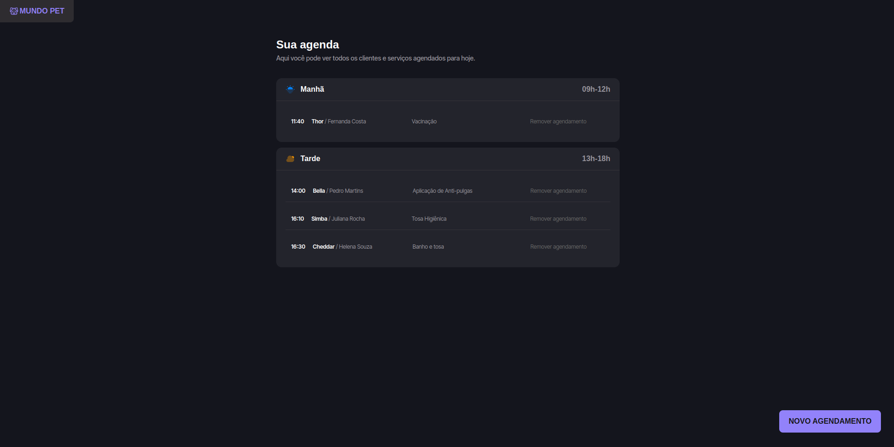
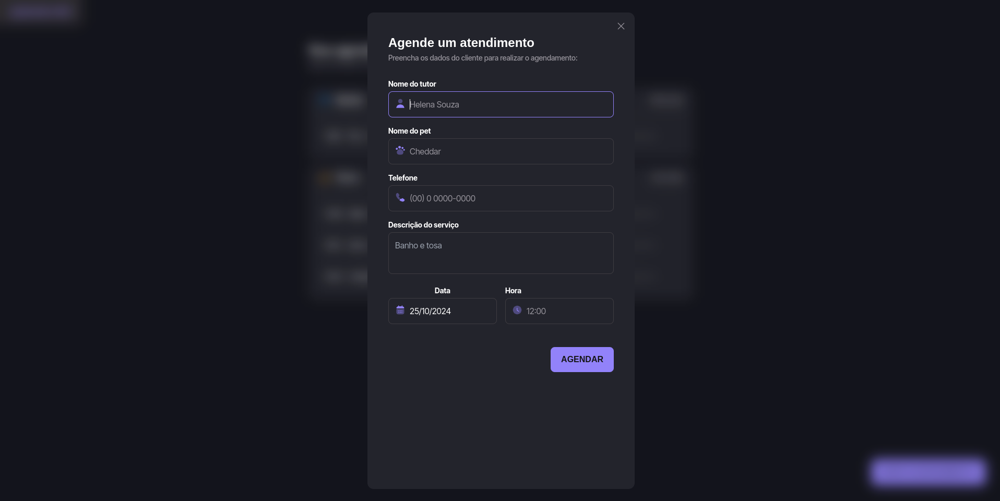

## 🐕 Agendamento de Petshop

<p align="center">
  
</p>

<p align="center">
  
</p>
<!-- ## Basic Overview - [Live Demo](https://react-shopping-cart-67954.firebaseapp.com/) -->

Sistema web para agendamento de serviços em petshops. 

**Funcionalidades:**
* Agendamento de serviços
* Gestão de clientes
* Relatórios gerenciais

**Tecnologias:**
* Frontend: Nextjs
* Banco de dados: SQlite

**Como executar:**
1. Clone o repositório
2. Instale as dependências
3. Configure o banco de dados
4. Inicie o servidor


✈️ [Me siga no LinkedIn](https://www.linkedin.com/in/samsepi0ldev/)

<!--
## Getting started

Try playing with the code on CodeSandbox :)

[](https://codesandbox.io/s/74rykw70qq)
 -->

## Build/Run

#### Requirements

- Node.js
- npm
- pnpm

```javascript

/* First, Install the needed packages */
pnpm install

/* Then start the React app */
pnpm run dev

```